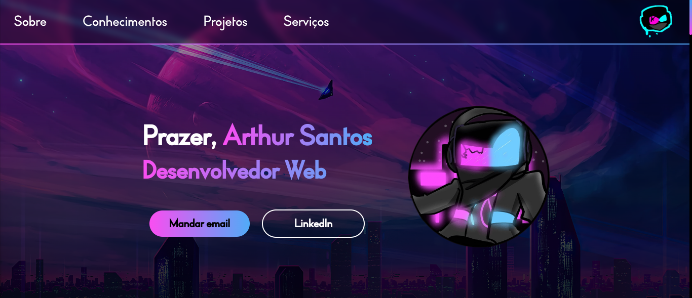

<h1 align="center">Portfólio - Arthur Santos</h1>

<h2 align="center">Meu portfólio de Desenvolvedor Web, contendo todos os meus projetos</h2>

<h2>➢ O que tem neste portfólio?</h2>

<ul type="circle">
    <li> Uma breve apresentação: onde você poderá conhecer melhor a mim e meu trabalho
    <li> Conhecimentos: Você verá todas as tecnologias/ferramentas que eu possuo experiência
    <li> Projetos: Você terá acesso a uma coleção de alguns de meus projetos pessoais e (futuramente) profissionais
    <li> Serviços: Você também saberá quais tipos de serviços que presto como desenvolvedor
    <li> Redes sociais e meios de contato: Links para minhas mídias sociais e para entrar em contato, caso queira contratar meus serviços :D
</ul>

 Você pode acessar o site através deste link: https://my-portfolio-xdef4lt.vercel.app/

<h2> ➢ Outras informações</h2>
<ul>
    <li> <strong>Status:</strong> <em>Desenvolvendo</em>
    <li> <strong>Conhecimentos aplicados:</strong>
    <ul>
        <li> 
            Procurei usar grande parte de meus conhecimentos de front-end para criar essa
            portfólio e, com o passar do tempo, irei atualizá-lo com novas funcionalidades 
            conforme aprendo coisas novas.
        </li>
    </ul>
</ul>

<h2> ➢ 